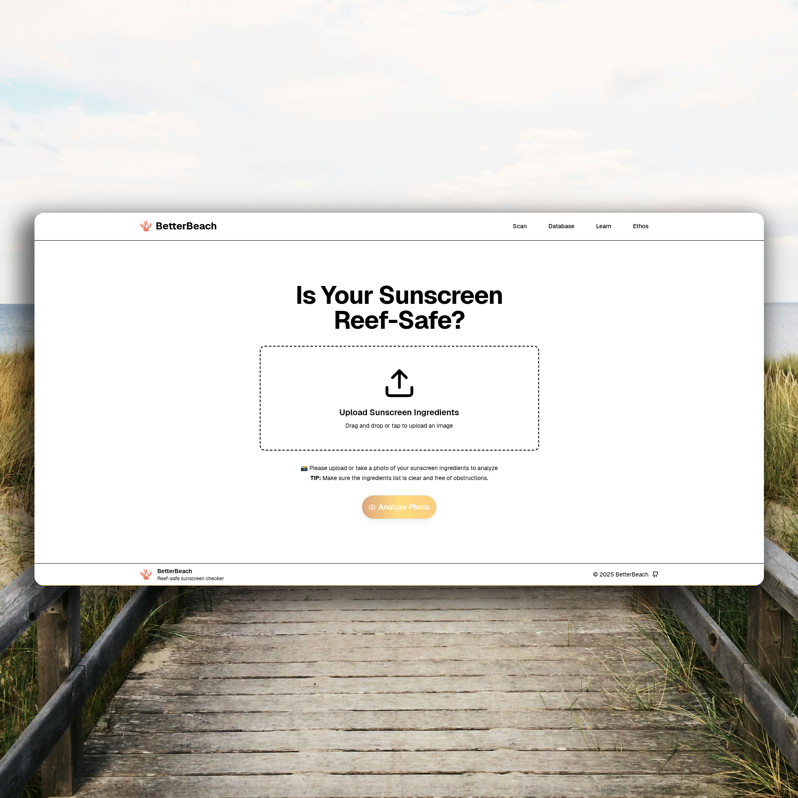

<div align="center">
  <h1>BetterBeach 🪸</h1>
  
  <p>
    An online tool to check if the ingredients of your sunscreen are safe for coral reefs.
  </p>

  <!-- Badges -->
<p>
  <a href="">
    
  </a>
  <a href="https://github.com/resslr/better-beach">
    
  </a>
  <a href="https://github.com/resslr/better-beaches/issues/">
    
  </a>
  <a href="https://github.com/resslr/better-beaches/blob/master/LICENSE">
    
  </a>
</p>

<div align="center"> 
  <kbd></kbd>
</div>
   
<h4>
    <a href="https://betterbeach.app">View Live</a>
  <span> · </span>
    <a href="https://github.com/resslr/better-beach/issues/">Report Bug</a>
  <span> · </span>
    <a href="https://github.com/resslr/better-beach/issues/">Request Feature</a>
  </h4>
</div>

<br />

<!-- Table of Contents -->

# Table of Contents

- [About the Project](#about-the-project)
  - [Features](#features)
- [Getting Started](#getting-started)
  - [Run Locally](#run-locally)
- [Contributing](#contributing)
  - [Code of Conduct](#code-of-conduct)
- [License](#license)
- [Contact](#contact)

<!-- About the Project -->

## About the Project

This project was created as a tool to be able to help prevent damage to the coral reefs by inputting harsh chemicals into the sea. Many people unknowingly harm coral reefs everyday by using sunscreen that contains Oxybenzone, Octinoxate, and/or Octisalate to name a few, these chemicals harm the development of coral reefs and usually lead to bleaching, which eventually leads to the death of that ecosystem.

<!-- Features -->

### Features

- Sunscreen Ingredient Scaning
- Harmful Chemical Database with Chemical Composition and Explanations
- Buy Reef-Safe Sunscreen Near You

<!-- Getting Started -->

## Getting Started

<!-- Prerequisites -->

### Prerequisites

This project uses [PNPM](https://pnpm.io/) as package manager, requiring both npm and nodejs. I personally installed pnpm through [corepack](https://github.com/nodejs/corepack) and recommend you to do the same in terms of compatability.

<!-- Run Locally -->

### Run Locally

Clone the project

```bash
  git clone https://github.com/resslr/better-beach.git
```

Go to the project directory

```bash
  cd better-beach
```

Install dependencies

```bash
  pnpm install
```

Build the project

```bash
  pnpm run build
```

Start the server

```bash
  pnpm run start
```

<!-- Contributing -->

## Contributing

Contributions are always welcome, and in fact if you notice any missing harmful ingredients you want to point out, I highly recommend you open an [issue](https://github.com/resslr/better-beach/issues/) to benefit others who may use this tool. Please read the CONTRI

<!-- Code of Conduct -->

### Code of Conduct

Please read the [Code of Conduct](https://github.com/Louis3797/awesome-readme-template/blob/master/CODE_OF_CONDUCT.md)

<!-- License -->

## License

Distributed under the MIT License. See [LICENSE](https://github.com/resslr/better-beach/blob/master/LICENSE) for more information.

<!-- C.A.C. FL27 -->

## Congressional App Challenge

This app was submitted to compete at the Florida Congressional App Challenge at the 27th Congressional District, I placed third for this app and will continue to work on it, including the changes for the proposed V2.

<!-- Contact -->

## Contact

If you need to contact me for any reason revolving around this respository please send me an email at [git@betterbeach.app](mailto:git@betterbeach.app). Thank you!
